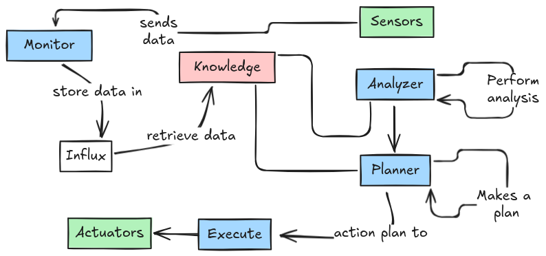

# Autonomous System with MAPE-K Loop

## Overview
This project implements an autonomous software system based on the MAPE-K loop (Monitor, Analyze, Plan, Execute, Knowledge). The system is designed to manage resources by monitoring environmental parameters and automatically adapting to changing conditions.

## Topic
> [!NOTE]
> to be decided...

## Tools and frameworks
To enhance variety, modularity and flexibility of the project, Docker is used to create different containers with specific goals.

- **Monitor**
  - **mosquitto**: uses mosquitto for the communications with actuators and sensors.
  - **sensors**: collect data from a simulated environment and send it to mosquitto Broker. (OSGi)
- **Analyze**
  - **analyzer**: a PHP server that receives the data sent by the sensors and makes some analysis to find possible anomalies or propose some optimizations.  
- **Plan**
  - **planner**: a nodejs server that decides an action plan based on the previus analysis.
- **Execute**
  - **mosquitto**: uses mosquitto for the communications with actuators and sensors.
  - **actuators**: constantly listening for the action. When they receive an order the simulated environment is modified to simulate a performed action. (OSGi)
- **Knowledge**
  - **influx**: uses influxdb, a time series database used to store data received from sensors and possibly some Knowledge related to the solution of expected problems.

## Autonomous system definition
This is an autonomous system, so it has to follow the following "self" rules:
- self-configuration
- self-optimization
- self-healing
- self-protection

## Self Managements implementations
This section shows the implementations of the 4 rules.

### self-configuration
> [!NOTE]
> to be decided...
### self-optimization
> [!NOTE]
> to be decided...

### self-healing
> [!NOTE]
> to be decided...

### self-protection
> [!NOTE]
> to be decided...

# Distribution
You can run this project on your personal machine.
## Pre-requisites
- git
- Docker
- The following ports must not be in use:
> [!NOTE]
> To be decided...

## Istallation
- Clone this repository with ``git clone``
- go inside the folder of the "compose.yaml" file and run ``docker compose up`` 
